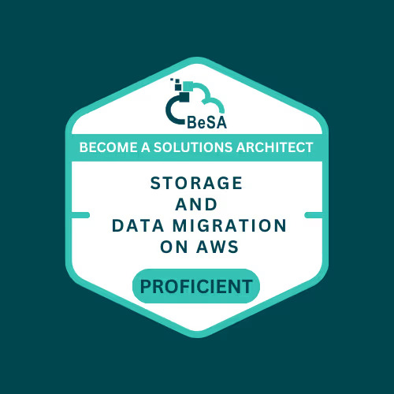

# Day 5/100

**Today’s Progress:**  
Studied AWS data migration tools.

**Learned:**  
EBS = block | EFS = file | S3 = object.  
DMS & DataSync for online migration; Snow Family for offline.

**Reflection:**  
Data migration is a strategy, not a single tool.

## Social Proof

[X Post](https://x.com/ramsi_k_/status/1976332195217473655)
